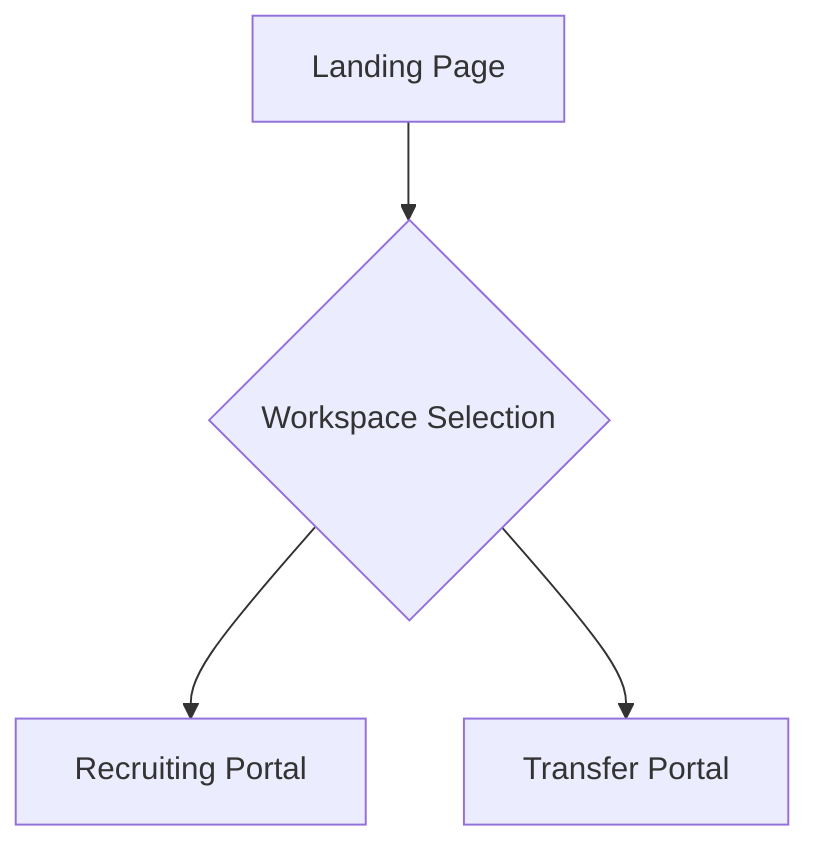
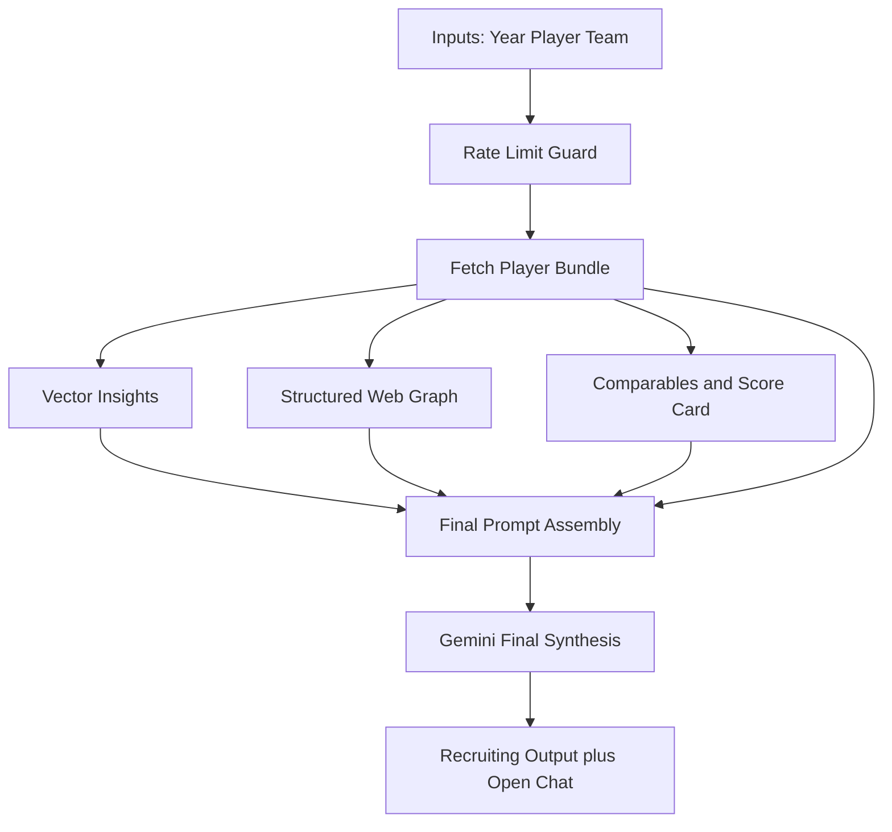
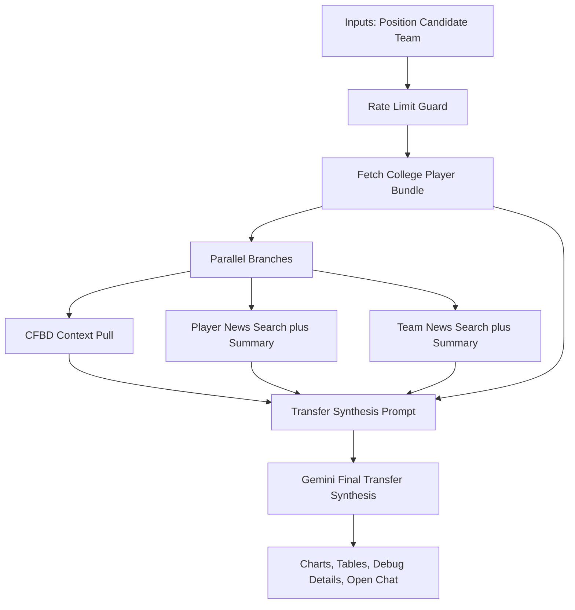
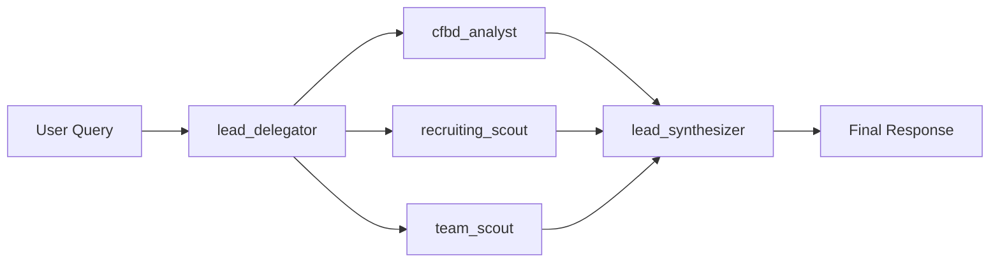

# Gridiron Intelligence Production App Structure

## Scope
This document summarizes the current production Streamlit app with three primary surfaces:
- Landing Page
- Recruiting Portal
- Transfer Portal

It also documents prompt composition patterns, multi-agent orchestration, and practical improvement paths.

## Runtime Architecture

### Core Layers
1. UI and routing: app.py
2. Orchestration and workflow services: engine/orchestration_service.py, engine/graph.py, engine/agents.py
3. Data and transforms: engine/data_access.py, engine/cfbd_service.py, engine/data_transforms.py
4. Prompt and synthesis: engine/synthesis_service.py, engine/tools.py
5. External systems: Supabase, CFBD API, DuckDuckGo, Gemini

### Page Entry Points
- Landing: render_landing_page
- Recruiting: render_structured_report_with_chat_page
- Transfer: render_potential_transfers_with_chat_page

## Page Workflows

## Landing Page
### Purpose
Navigation hub for workspace selection.

### Workflow
1. User opens app.
2. User selects Recruiting Portal or Transfer Portal.
3. App updates session page route and reruns.

### Summary Diagram


## Recruiting Portal
### Purpose
Build a structured recruiting report with web, vector, model, and comparable context, then support follow-up chat.

### Workflow
1. User selects year, player, target team.
2. Rate limiter validates submission.
3. App fetches player bundle from Supabase.
4. App runs vector insights query.
5. App runs structured web scouting graph:
   - recruiting_scout node
   - team_scout node
6. App computes historical comparables and score card.
7. App assembles final recruiting prompt.
8. Gemini generates final synthesis.
9. UI renders report cards, comparables, summaries, and open chat.

### Prompt Sample (Recruiting Final Synthesis)
```text
You are a senior college football recruiting scout.
Persona: Scout
Use only provided context. If data is missing, say so clearly.

Year: <year>
Target Team: <team>

Player Profile JSON: ...
Filtered Scouting JSON: ...
Prediction Threshold Probabilities: ...
Web Intelligence Summary: ...
Vector Insights: ...
Historical Comparables: ...
Tier Definitions: ...

Output sections in order:
1) Player Snapshot
2) Trait Evaluation
3) Scheme and Team Fit
4) Development Risks
5) Final Recommendation and Confidence
```

### Summary Diagram


## Transfer Portal
### Purpose
Generate transfer impact analysis from canonical CFBD pulls plus web context, then support follow-up chat.

### Workflow
1. User selects position, candidate, target team.
2. Rate limiter validates submission.
3. App fetches college player bundle.
4. App runs parallel branches:
   - CFBD context branch via orchestrate_transfer_cfbd_context
   - player web search and summary branch
   - team web search and summary branch
5. App merges branch outputs and builds transfer synthesis prompt.
6. Gemini generates transfer impact synthesis.
7. UI renders:
   - Final synthesis
   - Side-by-side charts (usage line and stat bar)
   - Tables
   - Debug details (branch health, raw and compact payloads)
   - Open chat

### Prompt Sample (Transfer Final Synthesis)
```text
You are a senior college football transfer-portal scouting analyst.
Use only provided context. Do not invent facts.

Player: <player>
Target Team: <team>

Context blocks:
- College Profile JSON
- CFBD 2025 Usage JSON
- CFBD 2025 Season Stats JSON
- CFBD Career Usage By Year JSON
- CFBD Career Season Stats By Year JSON
- Compact Usage Table JSON
- Usage YoY Delta Table JSON
- Compact Season Stats Table JSON
- Career Context JSON
- Exclude Garbage Time (CFBD pulls): true
- Player News Summary
- Team News Summary

Output sections in order:
1) Player Snapshot
2) 2025 Season Usage and Production
3) Career Arc and Transfer Context
4) Target Team Fit and Immediate Impact
5) Transfer Likelihood and Confidence
```

### Summary Diagram


## Multi-Agent Setup

### Scout Graph (Chat)
- lead_delegator
- cfbd_analyst
- recruiting_scout
- team_scout
- lead_synthesizer

### Structured Web Graph
- recruiting_scout
- team_scout

### Summary Diagram


## Summarizer Prompt Patterns
Current summarizer calls use plain markdown bullet instructions with payload grounding.

### Recruiting and Team Web Scouts
```text
Output ONLY plain markdown bullet points.
Summarize supplied snippets for scouting report context.
Use only supplied snippets and include caveats when uncertain.
```

### Transfer News Summaries
```text
Summarize transfer-portal relevant player or team context in plain markdown bullets.
Focus on transfer intent, eligibility, role expectations, depth chart competition, and recency.
```

## Full Mermaid Source Files
- diagrams/app_navigation_workflow.mmd
- diagrams/recruiting_portal_workflow.mmd
- diagrams/transfer_portal_workflow.mmd
- diagrams/multi_agent_setup.mmd
- diagrams/data_context_layers.mmd

## Improvement Paths

### 1. UI parity: Transfer visual language closer to Recruiting
- Introduce transfer summary cards similar to recruiting dossier cards.
- Add cleaner section framing and typography hierarchy for transfer outputs.
- Convert debug-heavy data into compact status cards with optional expanders.

### 2. Prompt quality review
- Normalize tone and section naming between recruiting and transfer final synthesis prompts.
- Add stronger failure-aware instructions when branch_status indicates skipped branches.
- Reduce redundancy in context blocks and cap payload verbosity per block.

### 3. Summarizer robustness
- Add explicit no-results templates that mention row counts and search status.
- Add optional source quality filtering before summarization.
- Preserve branch-level reason codes in rendered summaries for traceability.

### 4. Chart and table design
- Keep side-by-side chart layout on desktop and stack on small screens.
- Add better metric labels (humanized names) and optional unit badges.
- Default dropdown metrics by position-specific priority and non-null density.
- Add compact stat highlighting for key transfer indicators.

### 5. Operational reliability
- Keep full-shape fallback payload contracts for transfer async branches.
- Add lightweight persistent logging around branch timeout and failure reasons.
- Keep branch health visible in debug details for parity validation.

## Suggested Next Documentation Additions
1. Add a section for session-state key map and ownership.
2. Add a parity checklist template for debugger vs transfer validation.
3. Add a release checklist for prompt and chart/table regressions.
