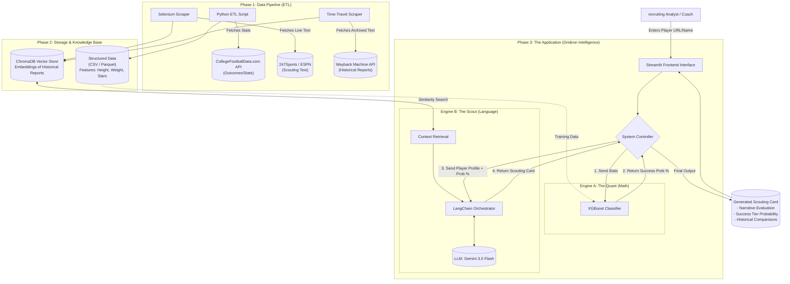

```mermaid
graph TD
    %% User Layer
    User[recruiting Analyst / Coach] -->|Enters Player URL/Name| UI[Streamlit Frontend Interface]

    %% Data Ingestion Layer
    subgraph "Phase 1: Data Pipeline (ETL)"
        direction TB
        Source1[("CollegeFootballData.com API<br/>(Outcomes/Stats)")]
        Source2[("247Sports / ESPN<br/>(Scouting Text)")]
        Wayback[("Wayback Machine API<br/>(Historical Reports)")]
        
        Scraper1[Python ETL Script] -->|Fetches Stats| Source1
        Scraper2[Selenium Scraper] -->|Fetches Live Text| Source2
        Scraper3[Time-Travel Scraper] -->|Fetches Archived Text| Wayback
    end

    %% Storage Layer
    subgraph "Phase 2: Storage & Knowledge Base"
        direction TB
        StructDB[("Structured Data<br/>(CSV / Parquet)<br/>Features: Height, Weight, Stars")]
        VectorDB[("ChromaDB Vector Store<br/>Embeddings of Historical Reports")]
        
        Scraper1 --> StructDB
        Scraper2 --> VectorDB
        Scraper3 --> VectorDB
    end

    %% Application Layer
    subgraph "Phase 3: The Application (Gridiron Intelligence)"
        direction TB
        Orchestrator{System Controller}
        
        subgraph "Engine A: The Quant (Math)"
            XGB[XGBoost Classifier]
            StructDB -.->|Training Data| XGB
        end
        
        subgraph "Engine B: The Scout (Language)"
            LangChain[LangChain Orchestrator]
            Gemini[("LLM: Gemini 3.0 Flash")]
            RAG[Context Retrieval]
            
            VectorDB <-->|Similarity Search| RAG
            RAG --> LangChain
            LangChain <--> Gemini
        end
        
        UI --> Orchestrator
        Orchestrator -->|1. Send Stats| XGB
        XGB -->|2. Return Success Prob %| Orchestrator
        
        Orchestrator -->|3. Send Player Profile + Prob %| LangChain
        LangChain -->|4. Return Scouting Card| Orchestrator
    end

    %% Output
    Orchestrator -->|Final Output| Card[("Generated Scouting Card<br/>- Narrative Evaluation<br/>- Success Tier Probability<br/>- Historical Comparisons")]
    Card --> UI
```